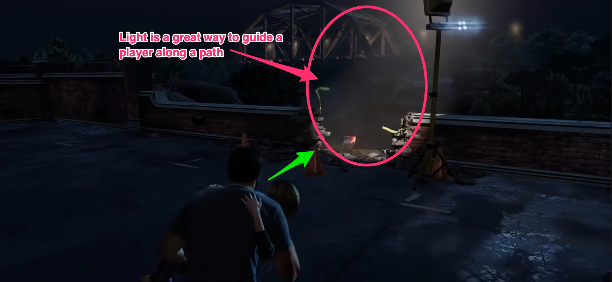
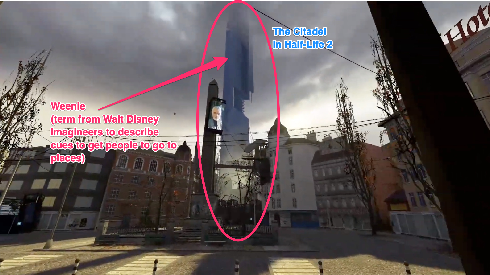

Welcome to the 1st issue of The Acagamic Tip Tuesday.

Each Tuesday, I will send you a tip from the world of UX Research & Design for games. At my website The Acagamic, I focus on training people to become better researchers and designers for games and beyond.

Each tip will take less than 3 minutes to read.

# Game UX Tip of the Week:
> Use artistic composition and environmental cues to guide players smoothly through your game.

In Shadow of the Tomb Raider, the Level Designers use painted areas to guide the player along walls and through the jungle.

Using light is a powerful way to guide players through the level. The Last of Us does this expertly as shiny objects usually indicate the direction the game designers want the players to go.

The arrangement of elements (pre-fabs) in Uncharted 3 levels always provides clues about where to go next. You can see the boards and lanterns arranged in the perfect swinging distance in the example above.

I recently talked about Weenies on my Instagram. Many games feature weenies as environmental cues to guide their players through levels. Using Weenies is like the visual foreshadowing of an exciting experience that players will engage in later.

# Bonus Video


# We still have GUR Book Webinar Tickets on Sale

