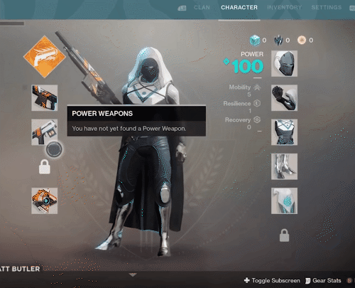

Hey there 🙋

Welcome to the 2nd issue of The Acagamic Tip Tuesday. Each Tuesday, I will send you a tip from the world of UX Research & Design for games. At my website The Acagamic, I focus on training people to become better researchers and designers for games and beyond. Each tip will take less than 3 minutes to read.

> Label unfamiliar icons. Make your game UI accessible.

In our globalized world of today, people from different cultures, who speak different languages and have varying degrees of gaming expertise, play video games. Because of this, user interfaces (UIs) for video games must be as easy to use and understand as possible. Adding labels to icons should become a standard part of user interface design, just like adding alt text to pictures is important for blind people who use technology. Symbols and colours will mean different things to different people because they come from different cultures. For games to stay approachable, it's important that each icon has a name. In this blog post, we'll talk about how labelling unfamiliar icons in video game user interfaces (UIs) can make the experience better for players. We'll use the popular games Destiny 2 and Firewatch as examples.

# Destiny 2: Complex Symbols and the Importance of Context

Destiny 2 is a first-person shooter with MMO (Massively Multiplayer Online) elements. It has a rich and complicated user interface with many icons that represent different items, abilities, and quests in the game. If you're new to the game, these signs can be a lot to take in and hard to understand. For example, the different classes and types in the game are shown by complicated symbols that might not be obvious at first.

To fix this problem, the developers have set up a simple labelling system, specifically for the inventory screen, that explains what these marks mean and where they belong. When a player hovers over an icon, a tooltip with a short description pops up. This helps them understand how the interface works. It makes it easier for people from different backgrounds to play the game, because they don't have to use outside tools to figure out what the icons mean.

Destiny 2 could benefit from a customizable UI that allows players to toggle between icon-only and labelled display modes. This would cater to experienced players who prefer a cleaner interface and newcomers who need more context to navigate the game effectively.

# Firewatch: Simplistic Design and the Role of Labels

In contrast to Destiny 2, Firewatch is an indie adventure game that features a minimalistic UI. The game's visual design is characterized by its simplicity, and its icons are no exception. For instance, the in-game map and compass use basic shapes and colors to represent different points of interest.

Despite its simplistic design, Firewatch could still benefit from labeling its icons. For example, the game labels things of relevance to the player directly in their field of view when needed with both icons and text. Adding these optional labels to the UI offers descriptions that clarify the icons' purpose. This way, players can enjoy a more accessible and immersive experience, regardless of their cultural background or gaming expertise.

Like providing alt text for images (which is vital for blind users when interacting with technology), providing labels for icons should also become standard practice in user interface design. Many players come from different cultural backgrounds, and symbols and colours will have different meanings. It is critical for keeping games accessible to have labels available for each icon.

# Best Practices for Labeling Unfamiliar Icons

Here are some best practices for labeling unfamiliar icons in video game UIs:

1. **Provide brief tooltip explanations:** Tooltips are an effective way to provide context for unfamiliar icons without cluttering the interface. Players can access a short description that clarifies the icon's purpose by hovering over an icon.

2. **Offer customizable display modes:** Allowing players to toggle between icon-only and labelled display modes ensures that the UI caters to different preferences and levels of gaming experience. This feature helps maintain a clean interface while still providing essential information for those who need it.

3. **Use clear and concise language:** When crafting labels for icons, it's crucial to use clear and concise language that can be easily understood by players from various cultural backgrounds. Avoid using slang, idioms, or culturally-specific phrases that may confuse some players.

4. **Consider colour-blind accessibility:** When designing icons and labels, it's crucial to remember that a significant portion of the gaming community may be colour-blind. Therefore, ensure that your labels and icons are distinguishable using shapes and patterns, in addition to colours, to maintain accessibility for all players.

5. **Test with diverse user groups:** If you want to make a truly accessible user interface, you need to test your icons and labels with a wide range of users, including those from different cultures, languages, and levels of gaming experience. This will help you find any possible problems or mistakes and make the necessary changes to make your game easier for everyone to play.

In closing, it's vital to video game UIs to have labels for new icons so that players from different cultures and with different levels of gaming experience can have a smooth and immersive experience. Developers can make user interfaces that are not only visually appealing but also accessible and open to everyone by including tooltips, giving customizable display modes, using clear and concise language, taking colour blindness into account, and testing with different user groups.

If you enjoy this newsletter, the best compliment you could pay me would be to share it with others on Twitter (see sharing icons below).



