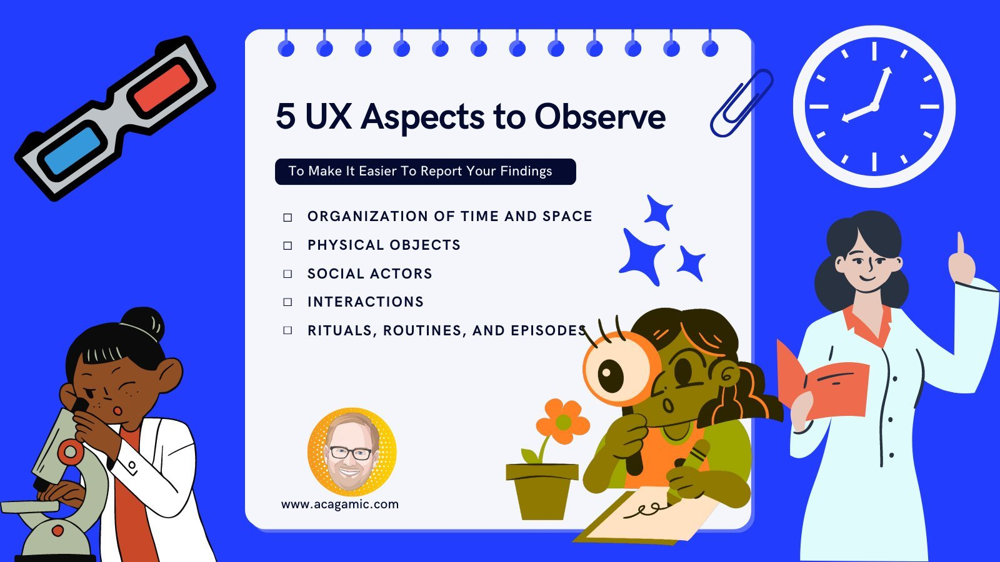

Hey there 👨‍🔬,

Each Tuesday, I will send you a tip from the world of UX Research & Design for games. At my website The Acagamic, I focus on training people to become better researchers and designers for games and beyond.

Each tip will take less than 3 minutes to read.

# Game UX Tip of the Week:
> Use observation systematically to study your users in the field.

Observation is a popular UX research method often driven by our curiosity and fascination. However, it is essential to understand that observation should be done systematically and with a purpose in mind.

The benefits of knowing what to observe will make it easier for you to write up your UX report findings later.

# Organization of time and space
Specifically, when you are doing a field study, channel your inner anthropologist and observe how time is organized, how makes decisions, and what kinds of activities and events are taking place. This will give you a feel for the action flow of a situation.

Please pay close attention to the layout and interior design of the space because groups and individuals tend to mark and protect their areas. Does this lead to conflicts you can observe?

# Physical Objects
Objects and their use have meaning in situations. Observe the physical objects present and take note of how things are used. Can you make out what different objects symbolize in this setting? Which are private and which are public and possibly shared? Does anyone control access?

# Social Actors
How people look and behave in shared space and time is key to unlocking the social complexities. Can you distinguish people’s status and social categories from observing their relationships? Do you follow a professional hierarchy based on looks and behaviours, or does everything feel homogenous to you?

# Interactions
Observing what people do and how is key to unlocking the underlying dynamics of a place. Watch nonverbal behaviours and what people say formally and informally (tone, topics, context are all important). Find out who communicates how, when, and where. Finally, reflect on your feelings and reactions. Why are you interacting the way you do?

# Rituals, Routines, and Episodes
See if you can tease apart routine actions from unusual ones. Which rituals are formally recognized and which happen informally? Can you observe episodes or behaviour action-reaction chains between people? How do they express their emotions?

# Acknowledge you are human
Keep in mind that you cannot observe everything. Narrow your observation focused on your research problem.

Shoutout for this inspiration to Ciesielska, M., Boström, K. W., & Öhlander, M. (2018). Observation methods. In Qualitative methodologies in organization studies (pp. 33-52). Palgrave Macmillan, Cham.

# Noteworthy Tweets





