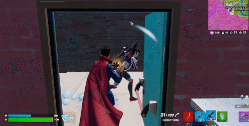
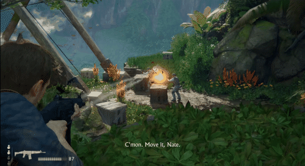

Welcome back to The Acagamic Tip Tuesday.

Each Tuesday, I will send you a tip from the world of UX Research & Design for games. At my website The Acagamic, I focus on training people to become better researchers and designers for games and beyond.

Each tip will only take a few minutes to read.

**Game UX Tip of the week**
> Be consistent and clear in your feedback choices in your games. Consistency is key. Feedback must be clear.

Consistent patterns in games that match players’ expectations are critical for a smooth gameplay experience. If you make an aesthetic choice for your feedback, be consistent in how you present the feedback to the player and make sure the feedback is clear.

The gore in Elden Ring is used as feedback, but assisted by a life bar that depletes.

The colourful theme in Fortnite uses coloured numbers to provide feedback.

Uncharted 4 uses less UI feedback and relies more on character animations.

Dishonored as a stealth game blends UI and immersive elements of feedback.

# Two Tweets





# Two Videos



---



# Two Links

- [Elden Ring's Minimal UI And HUD Elements Have Started Maximum Dev Debates](https://kotaku.com/elden-ring-ui-ux-user-experience-interface-fromsoftware-1848637410)
- [The Usability of Bloodborne](https://www.gamedeveloper.com/design/the-usability-of-bloodborne)