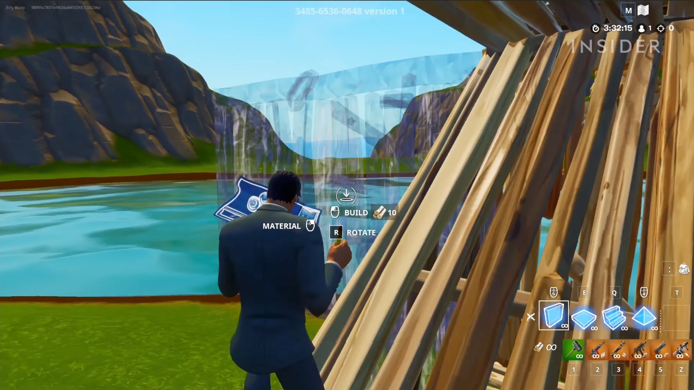
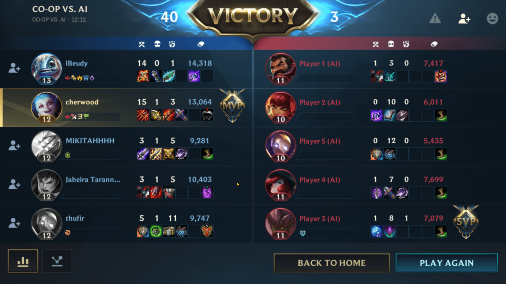
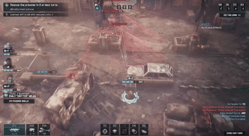

Each Tuesday, I will send you a curated tip from the world of UX Research & Design for games. At my website The Acagamic, I focus on training people to become better researchers and designers for games and beyond.

Each tip will only take a few minutes to read.

> Avoid putting too much cognitive load on the player when engaging in game actions. People are bad at multitasking.

If you want present complex information to players it is usually best done during a break or pause in the game or after a match. If you are not building a game with real-time actions (like turn-based strategy), you can choose to present more information to players because they have more time to process it before deciding on a move.

# Three Tweets





