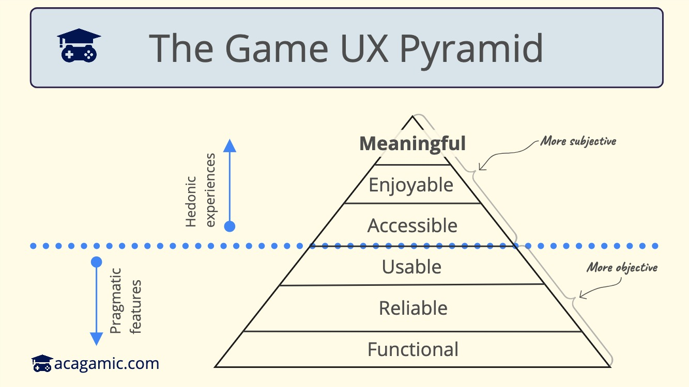

In today's issue, I want to break down game UX design layer by layer. This is based on work I saw on the UX pyramid from Avi Vijh and previous ideas in the book Seductive Interaction Design by Stephen Anderson. The UX pyramid suggests building a product with different layers, starting from the most basic needs at the bottom and working upwards to more complex ones. I was wondering how to apply this to game UX.

Unfortunately, far too many game UX researchers get stuck in the muddy trenches of the design process. They grapple with fragmented player feedback, navigate complex mechanics, and sometimes lose sight of what makes a game truly memorable: an immersive, player-centric experience. Let's break down how this experience could unfold.

## Stage 1: Functionality

At this level, we're ensuring the game does what it's supposed to - run smoothly across all modern platforms, incorporate vital features, and meet basic accessibility standards. For example, this may include testing different resolutions and framerates to confirm that UI elements scale appropriately.

Enhancing your game's functionality isn't rocket science. Prioritize high-value player actions and cut down on unnecessary clicks. Aim for a streamlined onboarding process, and reduce repeated inputs. Design for data retention. Players should be able to exit and return without losing their progress.

Remember, the learning curve should be intuitive. You can achieve this by making well-defined action functions, highlighting tasks and quests, adding progress bars to multi-step tasks, and disabling extra features by default.

## Stage 2: Reliability

There should be no ambiguity in your game. Feedback needs to be accurate and clean across consoles, mobile, and targeted devices. Creating a reliable game means understanding the devices your players use, and creating UIs that are accurate.

## Stage 3: Usability

A game should be a map players want to explore, not a maze where they get lost. The game should be intuitive and designed with the user in mind. Controls should be easy to understand. Feedback should be clear and consistent for the user. They should be able to find (but not retrieve) the content they need effortlessly. This is where we meet basic game UX best practices. Examples include using intuitive controls, providing clear and consistent feedback, and designing a game that is easy to navigate (unless navigation is your core game mechanic/challenge).

Work with UX experts and conduct player testing to improve usability. Usability testing in games involves observing users playing the game, collecting data on their performance, and making design changes or refinements based on the results. Learn to perform heuristic evaluations. To find and fix usability issues in games, playtest your game and use analytical tools.

## Stage 4: Accessibility

Your game reaches this level when players actively seek out opportunities to engage with it. 

To make your game more accessible, eliminate physical and cognitive barriers preventing play. This can be done by providing intuitive instructions and tutorials, so that all the game’s features are easy to understand. Make user flow a breeze by placing content precisely where it’s needed in the game. Create clear player expectations, and give players the reins to manage their own experiences and challenge levels.

## Stage 5: Enjoyability

Your game is enjoyable if players embrace it and promote it freely. Players will return to your game if they find it enjoyable. The addition of random elements can make a game more fun. When unexpected events and outcomes are introduced, players are kept on their toes and experience a greater sense of anticipation and surprise. Creating your own levels is another way to make games more fun. As a result, players can customize the game according to their own preferences and challenge themselves more meaningfully. Furthermore, adding collaborative elements to the game can enhance its enjoyment. The presence of multiple players in the same game can enhance engagement and create a more social environment. Guiding players through gameplay errors also improves their experience.

## Stage 6: Meaning

Here your game becomes more than just a pastime. The player's experience is defined by the reflective and behavioural aspects of the game. Players are required to consider the consequences of their actions in some games that incorporate ethical choices. Instead of simply completing tasks, other games reward players for making meaningful decisions. Yet other games reward players for improving their dexterity and strategic thinking by increasing the difficulty exponentially. Lastly, players can be rewarded with surprising turns and unexpected events when they play through a gripping story.

To reach the top of the pyramid, focus on minimizing pain points and unintentional player obstacles. Personalize your game to help players improve their skills, health, and life. Think about the experience beyond the game's content. Cater to your players' changing needs and evolving experiences. Regular player research is crucial here. This is the heart of game UX design.

Consider this pyramid as a compass for your next game UX design project. It can help you understand why some games soar while others plummet. Use player research to identify game elements that need revamping and prioritize them. Consider also the game's tutorial and onboarding process, as well as the emotional connection the game creates with players. Finally, make sure that the game UX design evolves constantly with your players. 