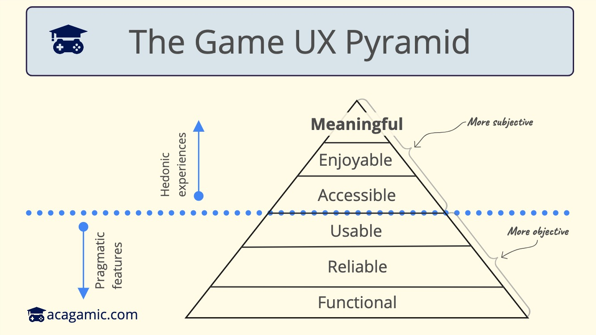

In today’s issue, I want to break down UX in game design layer by layer or UX teams in the video game industry. User experience (UX) is a result of game mechanics that game designers, video game developers, and the experience design team use to make the game.

# User Experience Design in Gameplay with the Experience Pyramid
## What is UX Design and How Does it Relate to Video Game Design?

User Experience (UX) design is an integral part of any product or service, and games are no exception. In essence, UX is all about understanding and addressing user needs to enhance user satisfaction with a little help of human psychology. You want to create a design approach allowing users to perform tasks and making people want to play. Player engagement and retention mean that players want to spend time with the design features (like levelling up to the end game) of a game. When we talk about UX in games, we're referring to the process of creating a game that provides a satisfying, seamless, and enjoyable experience for the player. As a game designer, your goal should be to make the game easy to understand and fun to play. In addition, you should ensure that it offers a unique and memorable game experience inside the game.

## An Introduction to the Different Stages of the UX Pyramid

This pyramid is a design methodology used in design thinking to depict different stages of the design process to make it easy for players interacting with the game. It serves as a roadmap for UX designers, guiding them through the process of designing a product or service that meets and exceeds user expectations. In the context of playing a game regularly, the levels of the pyramid can help game developers and designers testing the game understand the game from the player's perspective. It can also help them make informed design choices that enhance the game but also experience.

Design choices influence rules of the game to help create a balanced and enjoyable experience for players. Designer expertise is also key to the success of the game. A design must consider the game's story, characters, mechanics, and rules. With the right combination of these elements, a game will keep players engaged without having to go through complex menus. The interface and user experience of the game should always be taken into account. A designer needs to be aware of the features of the game, its pacing, and the overall level of difficulty. The value of a financial investment in UX can be seen in the long-term retention and engagement of players, which leads to increased revenue over time. With the right combination of UX principles, developers and designers can create a game that will keep players engaged and provide an enjoyable experience, and help them develop new products and services. With the right UX design methodology, game developers create an experience for players to find what they are looking for in the game.

Poor UX can lead to frustration, lack of engagement, and decreased user retention. The player experience pyramid that I'm proposing is a seamless approach to good UX design that focuses on understanding and meeting user needs through users' experiences. This is based on work I saw from Avi Vijh and previous ideas in the book Seductive Interaction Design by Stephen Anderson. The thinking process behind the pyramid suggests building a product with different layers for the best user experience, starting from looking at the different most basic needs at the bottom and working upwards to more complex ones. I was wondering how to apply this to user research and user interfaces in games and make a good game.

Unfortunately, far too many game developers and UX designers get stuck in the muddy trenches of the design process. They grapple with fragmented player feedback, how to pull players back into the game, do level design, user testing, navigate complex mechanics, menu animations for the target audience, and sometimes lose sight of what makes a game truly memorable: an immersive, player-centric experience (not that the game is easy but that users should be able to play video games for the enjoyment of the game). Let’s break down how this in-game experience could unfold.

## Stage 1: Functionality in Gameplay

At this level, we’re ensuring the game does what it’s supposed to - run smoothly across all modern platforms, incorporate vital features, and meet basic accessibility standards. For example, this may include testing different resolutions and framerates to confirm that UI elements scale appropriately.

Enhancing your game’s functionality isn’t rocket science. Prioritize high-value player actions and cut down on unnecessary clicks. Aim for a streamlined onboarding process, and reduce repeated inputs through better UI design in the game world. Design for data retention. Players should be able to exit and return without losing their progress.

Remember, the learning curve should be intuitive. You can achieve this by making well-defined action functions, highlighting tasks and quests, adding progress bars to multi-step tasks, and disabling extra features by default.

## Stage 2: Reliability of User Experience

There should be no ambiguity in your game. Feedback needs to be accurate and clean across consoles, mobile, and targeted devices. Creating a reliable game means understanding the devices your players use, and creating UIs that are accurate while the visual design of them created a desire for the product, critical to its success.

## Stage 3: Usability in UX Game Design

A game should be a map players want to explore, not a maze where they get lost. The game should be intuitive and designed with the user in mind. Controls should be easy to understand. Feedback should be clear and consistent for the user. They should be able to find (but not retrieve) the content they need effortlessly. This is where we meet basic game UX best practices. Examples include using intuitive controls, providing clear and consistent feedback, and designing a game that is easy to navigate (unless navigation is your core game mechanic/challenge).

Work with UX experts and conduct player testing to improve usability. UX testing in games involves observing users playing the game, collecting data on their performance, and making design changes or refinements based on the results. Learn to perform heuristic evaluations. To find and fix usability issues in games, playtest your game and use analytical tools.

## Stage 4: UX and UI Accessibility

Your game reaches this level when players actively seek out opportunities to engage with it. This is not about ergonomics, but more about bringing the game to the player.

To make your game more accessible, eliminate physical and cognitive barriers preventing play. This can be done by providing intuitive instructions and tutorials, so that all the game’s features are easy to understand. Make user flow a breeze by placing content precisely where it’s needed in the game. Create clear player expectations, and give players the reins to manage their own experiences and challenge levels.

## Stage 5: Enjoyability of the Game Experience

Your game is enjoyable if players embrace it and promote it freely. Players will return to your game if they find it enjoyable. The addition of random elements can make a game more fun. When unexpected events and outcomes are introduced, players are kept on their toes and experience a greater sense of anticipation and surprise. Creating your own levels is another way to make games more fun. As a result, players can customize the game according to their own preferences and challenge themselves more meaningfully. Furthermore, adding collaborative elements to the game can enhance its enjoyment. The presence of multiple players in the same game can enhance engagement and create a more social environment. Guiding players through gameplay errors also improves their experience.

## Stage 6: Meaning in Gameplay

Here your game becomes more than just a pastime. The player’s experience is defined by the reflective and behavioural aspects of the game. Players are required to consider the consequences of their actions in some games that incorporate ethical choices. Instead of simply completing tasks, other games reward players for making meaningful decisions. Yet other games reward players for improving their dexterity and strategic thinking by increasing the difficulty exponentially. Lastly, players can be rewarded with surprising turns and unexpected events when they play through a gripping story.

To reach the top of the pyramid, focus on minimizing pain points and unintentional player obstacles. Personalize your game to help players improve their skills, health, and life. Think about the experience beyond the game’s content. Cater to your players’ changing needs and evolving experiences. Regular player research is crucial here. This is the heart of UX design. Continue to monitor and adjust your game to ensure that it meets player needs and expectations.

Consider this pyramid as a compass for your next user-centered design project. It can help you understand why some games soar while others plummet. Use player research to identify game elements that need revamping and prioritize them. Consider also the game’s tutorial and onboarding process, as well as the emotional connection the game creates with players. Finally, make sure that the game UX design evolves constantly with your players.